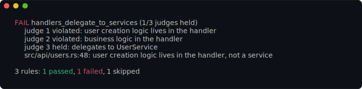
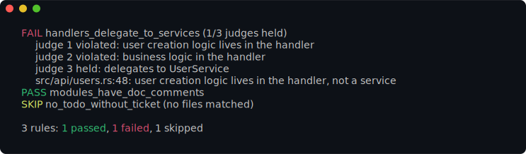

# llmlint

**The next generation of linting: an LLM as a judge.** `llmlint` enforces the
code-quality checks a human reviewer normally makes — adherence to architectural
patterns, coding-style intent, alignment to organization objectives — that
deterministic linters can't express. It is **additive** to your existing linters,
not a replacement: keep using deterministic tools for everything they can already
check, and reach for llmlint only for the judgment calls.

Each check is a **rule**: a statement about your code that is judged `true`
(holds) or `false` (a violation). llmlint batches your rules, drives a real coding
harness (Claude Code, Codex, Cursor, …) through
[`oneharness`](https://github.com/nickderobertis/oneharness) to read the relevant
files and decide, and reports the violations — with file and line numbers where
they can be pinned down. Because the gate is "just a config file," llmlint drops
into CI next to your other linters.

By default llmlint reports the failing rules (with the locations it could pin
down) and a one-line summary — passing and skipped rules are just counted:

```console
$ llmlint
FAIL handlers_delegate_to_services (2/3 judges held)
     src/api/users.rs:48: user creation logic lives in the handler, not a service

3 rules: 1 passed, 1 failed, 1 skipped
```



Add `-v` to itemize *every* rule (passed and skipped too) and to print the
oneharness debug view — the exact `oneharness run …` command and the raw result
for each judge — to **stderr**, so the report on stdout stays clean:

```console
$ llmlint -v
PASS modules_have_doc_comments
FAIL handlers_delegate_to_services (2/3 judges held)
     src/api/users.rs:48: user creation logic lives in the handler, not a service
SKIP no_todo_without_ticket (no files matched)

3 rules: 1 passed, 1 failed, 1 skipped
```



> These are real captures of the CLI, rendered from the actual colorized output
> by [`just screenshots`](screenshots/AGENTS.md) and gated by
> [screencomp](https://github.com/nickderobertis/screencomp).

The exit code is unaffected by verbosity (`0` all-pass, `1` a violation, `2`
the run couldn't complete); operational errors are always shown. Use
`--format json` for the full machine-readable report.

The human report is **colorized** — green `PASS`, red `FAIL`/`ERROR` — when
stdout is a terminal. Coloring follows the [`NO_COLOR`](https://no-color.org)
convention and a `--color <auto|always|never>` flag: `auto` (the default) colors
only an interactive terminal, `always` forces it (e.g. through a pager or to
capture a screenshot), `never` disables it. `--format json` is never colorized.

## How it works

1. You declare **rules** (and optionally **agents** that group them) in a YAML
   config — like any other linter.
2. For each agent, llmlint renders a system prompt from a template (the rules +
   the target file paths) and calls `oneharness run` with a generated **JSON
   Schema** for structured output. oneharness constrains and validates the
   harness's answer, so llmlint gets a checked verdict per rule, not prose.
3. The harness reads the target files on demand with its own tools to gather
   evidence, then returns `{ "rule_name": { "holds": bool, "violations": [...] } }`.
4. llmlint aggregates (majority vote across judges when configured), reports, and
   exits non-zero if any rule was violated.

llmlint **shells out to oneharness** — it is a runtime prerequisite (see Install).

## Install

`llmlint` needs the `oneharness` binary on your `PATH`.

```console
# 1) oneharness (the harness driver)
curl -fsSL https://raw.githubusercontent.com/nickderobertis/oneharness/main/scripts/install.sh | sh
#    (or: cargo install --git https://github.com/nickderobertis/oneharness --locked)

# 2) llmlint
curl -fsSL https://raw.githubusercontent.com/nickderobertis/llmlint/main/scripts/install.sh | sh
#    (or: cargo install llmlint --locked)
#    (or, without a crates.io release: cargo install --git https://github.com/nickderobertis/llmlint --locked)

llmlint doctor      # confirms oneharness is reachable
```

The installer honors `LLMLINT_VERSION` / `LLMLINT_INSTALL_DIR` (or the `--version`
/ `--to` flags), works on Linux, macOS, and Windows under a POSIX shell
(Git Bash / MSYS / WSL), and refuses an archive whose checksum does not match.
Each tagged release publishes prebuilt, checksummed binaries for those
platforms; on native Windows PowerShell, use `cargo install llmlint --locked`.

You also need a coding harness installed and authenticated (e.g. Claude Code).
See `oneharness list` / `oneharness detect --all`.

## Quick start

```console
llmlint init                 # write a starter llmlint.yml (config-lint plugin on)
llmlint init --with-template # ...and embed the prompt template to customize
$EDITOR llmlint.yml          # write your rules
llmlint                      # lint the configured files
llmlint src/api/**/*.rs      # ...or lint specific files
llmlint --format json        # machine-readable output
```

## Configuration

`llmlint.yml` (discovered by walking up from the working directory; override with
`-c/--config`, repeatable). `llmlint init` writes it with a leading
`# yaml-language-server: $schema=…` modeline pointing at llmlint's
[published JSON Schema](assets/llmlint.schema.json), so editors with the YAML
language server (e.g. VS Code's [YAML extension](https://marketplace.visualstudio.com/items?itemName=redhat.vscode-yaml))
give completion and validation as you write. Add the same line to a hand-written
config to opt in.

```yaml
version: 1                     # this config's published version (used when it is consumed as a plugin)

# Files linted when none are passed on the CLI.
files:
  include: ["src/**/*.rs"]
  exclude: ["**/generated/**"]

# Require a short `rationale` for every verdict (default true). See Rationales below.
rationales: true

# Pull in shared rule sets / plugins with one line each. An entry is a local
# path or a URL (`http(s)://`, `file://`); pin a URL to a version with `@`.
plugins:
  - "https://raw.githubusercontent.com/nickderobertis/llmlint/main/assets/config_lint.yml@1"  # bundled: lints this config's own rules
  - "https://example.com/org-rules.yml@1.2.3"   # pinned; fetched + cached once
  - "./team-rules.yml"

# Agents group rules and add reviewer context + harness/model/batch config.
# YAML anchors let you share prompt text with zero framework support.
agents:
  architecture:
    harness: claude-code       # any id from `oneharness list`; omit to use oneharness's own default
    model: opus
    batch_size: 15             # rules per judge run (default 20)
    prompt_template: |         # appended to the master template before render
      You are a senior software architect reviewing service boundaries.

rules:
  - name: handlers_delegate_to_services   # unique, terse, descriptive
    description: |
      TRUE when every HTTP handler delegates business logic to a service layer.
      FALSE when a handler performs business logic (DB queries, domain rules)
      inline.
    agent: architecture        # optional; omit to use the default agent
    judges: 3                  # optional; independent judges, majority wins (default 1)
    rationale: true            # optional; override the session-wide `rationales` for this rule
    files:                     # optional; override the target files for this rule
      include: ["src/api/**"]
```

### Writing good rules

- **Phrase each rule as a positive invariant.** `holds = true` means the code
  complies; `holds = false` is a violation that llmlint reports and fails on.
- **Make the true/false outcome unambiguous and mutually exclusive** — state when
  it is true *and* when it is false. The bundled config-lint plugin (the
  `config_lint.yml` URL above) lints your config for exactly this, plus
  descriptive (non-placeholder) names that match what each rule checks.
- **Names** are unique, terse, and descriptive (`^[A-Za-z][A-Za-z0-9_]*$`); they
  become the JSON keys of the structured output.

### The prompt template

llmlint renders the judge's system prompt from a
[minijinja](https://docs.rs/minijinja) (Jinja2-style) template. The bundled
default lives in [`assets/default_template.md`](assets/default_template.md); embed
a copy to customize with `llmlint init --with-template`, or set `prompt_template`
yourself. The top-level `prompt_template` *replaces* the master template; an
agent's `prompt_template` is **appended** to it before rendering, so reviewer
context you add per-agent sees the same variables.

Three variables are in scope when a template renders:

| Variable | Type | Description |
| --- | --- | --- |
| `files` | list of strings | The target file paths for this run — relative to the working directory, always forward-slashed (so a Windows run reads the same as Linux/macOS). |
| `rules` | list of objects | The rules in this batch. Each has `.name` (the identifier, also the JSON key in the structured output), `.description` (the invariant to judge), and `.rationale` (whether this rule wants a justification). |
| `rationales` | bool | True when any rule in this batch wants a rationale — gate the rationale guidance on it. |

```jinja
## Target files
- {{ f }}

## Rules to evaluate
### {{ r.name }}

{{ r.description }}

```

A run is one `(agent, file set, judge)` batch, so `rules` is that batch's slice
(see `batch_size`), not necessarily every rule in the config.

### Rationales

By default each judge must justify every verdict with a short **rationale**. The
structured output for each rule is ordered deliberately — the judge echoes the
rule **name**, writes the **rationale**, then commits to the **result**
(`holds` + any `violations`):

```jsonc
{
  "no_inline_sql": {
    "name": "no_inline_sql",                       // 1. anchor on the rule
    "rationale": "raw SQL built inline in db.rs:42, not via the query layer",  // 2. reason
    "holds": false,                                // 3. conclude
    "violations": [{ "file": "src/db.rs", "line": 42, "message": "inline SQL" }]
  }
}
```

Reasoning *before* concluding (and naming the rule first) keeps each verdict
consistent and targeted — it leans on the model's next-token prediction so the
`holds` follows from the evidence just written, not the other way round. Beyond
that, rationales buy you:

- **Auditability** — a durable record of *why* each verdict landed, carried in
  `--format json` for every rule (pass or fail).
- **Debugging** — when a verdict looks wrong, you see the judge's reasoning, not
  just a bare pass/fail.
- **Reliability** — verdicts are measurably steadier when the judge must commit
  to evidence first.

The cost is **extra output tokens on every request**. Turn rationales off to
save tokens:

```yaml
rationales: false            # session-wide default (CLI --no-rationales overrides it)

rules:
  - name: handlers_delegate_to_services
    description: ...
    rationale: true           # …but keep them for this high-stakes rule
```

Precedence, lowest to highest: the session default `rationales` (default `true`)
→ a per-rule `rationale` → the `--rationales` / `--no-rationales` CLI flags
(which set the session default for the run; a per-rule `rationale` still wins).
In the human report, a rule's rationale is shown for every **failure** by
default, and for **every evaluated rule** at `-v`. The default prompt template
asks for rationales that are terse and pithy — the fewest tokens that still cite
the evidence — so the token cost stays small.

For a **multi-judge** rule (`judges: N`), the report and `--format json` show
**each judge's** result and rationale, not just one representative — so you can
see exactly where the judges agreed or split:

```text
FAIL no_inline_sql (1/3 judges held)
     judge 1 violated: raw SQL concatenated at db.rs:3
     judge 2 held: all access goes through the query builder
     judge 3 violated: f-string SQL in the helper
     src/db.rs:3: inline SQL
```

### Judges and voting

`judges: N` runs a rule through `N` independent judges and takes the **majority**
verdict. `N` must be **odd** (1, 3, 5, …) so the vote can't tie — an even count is
a config error. Only rules that opt in pay the extra cost: judge 1 runs all rules,
judge 2 only the rules with `judges >= 2`, and so on.

### oneharness passthrough

llmlint lets oneharness discover its own `oneharness.toml` by default. To force a
specific oneharness config, use `--oneharness-config <path>` (or `oneharness.config`
in the llmlint config); it is forwarded via oneharness's `--config`. Override the
binary with `--oneharness-bin` or `$LLMLINT_ONEHARNESS_BIN`.

### Plugins (shared rule sets)

`plugins` pulls other llmlint configs into this one — their rules and agents are
merged in. For the **top-level settings** (template, files, oneharness,
rationales), **the nearer config to the root wins**: your config's settings take
precedence over a plugin's, a plugin's over its own plugins', and an
earlier-listed plugin over a later sibling. A plugin only *fills in* a setting
the including config left unset, so a shared plugin can ship sensible defaults
without overriding what you set locally. The CLI overrides all of them (see
Commands). Each entry is a config file:

- a **local path** (`./team-rules.yml`), resolved relative to the including file;
- a **URL** — `http(s)://` (fetched over HTTPS) or `file://` (read directly).

Resolution is **transitive**: a pulled-in config's own `plugins` are pulled in
turn, and so on. Diamonds and cycles are de-duplicated (each config loads once),
and the chain is bounded at a depth of 100 to fail fast on a pathological graph.

URL fetching is built in (a pure-Rust HTTPS client — no `curl` or other external
tools, no system OpenSSL) and honors the standard `HTTP(S)_PROXY` / `NO_PROXY`
env vars. The bundled config-lint plugin ships inside the binary and resolves
**offline**.

A URL may be **pinned to a version** with an `@` suffix matching the plugin
config's own top-level `version`: `@1` accepts any `1.x`, `@1.2` any `1.2.x`,
`@1.2.3` exactly that. The pin is both an assertion (a mismatch is a hard error)
and the **cache key**: a pinned URL is fetched once into the cache and reused on
later runs without refetching — bump the pin to pull a new version. An *unpinned*
URL is fetched every run.

The cache lives under `$XDG_CACHE_HOME/llmlint/plugins` (override with
`LLMLINT_CACHE_DIR`). Set `LLMLINT_PLUGIN_REFRESH=1` to force a refetch.

## Commands & exit codes

- `llmlint [FILES...]` — lint (the default). `--format human|json`, `--agent`,
  `--rule`, `--max-parallel`, `--timeout`, `--cwd`. Target individual rules with
  `--rule NAME` (repeatable) or a whole group with `--agent NAME`; an unknown
  rule/agent name is an exit-2 error that lists the available names. Every
  top-level setting also has a flag that wins over the config:
  `--rationales`/`--no-rationales`, `--model NAME`, `--schema-max-retries N`,
  `--prompt-template PATH`, plus `--oneharness-bin`/`--oneharness-config`.
- `llmlint init` — write a starter config (`--with-template`, `--global`, `--force`).
- `llmlint config` — print the merged config and its sources as JSON.
- `llmlint doctor` — check that oneharness is installed and reachable.

Exit codes: `0` all rules hold · `1` at least one violation · `2` usage,
configuration, or harness error (could not complete the lint).

## Development

```console
just bootstrap   # toolchain components + fetch (from a clean clone)
just check       # full gate: fmt, clippy -D warnings, tests + 95% coverage, docs
just test-e2e    # the e2e binary journeys in isolation
just deps-check  # cargo deny + cargo machete
just lint-live   # opt-in: ad-hoc lint against the REAL oneharness + a real harness
just live-claude # opt-in: live e2e — built llmlint → real oneharness → real harness
```

Tests drive the real `llmlint` binary against a hermetic mock-oneharness fixture.
The live tier (`just live-claude`, and the ad-hoc `just lint-live`) drives the
whole stack end to end against a real, authenticated harness — the only thing that
makes real model calls, and out of the `check` gate. It runs on PRs in its own
workflow across Linux/macOS/Windows, so a missing CLI, auth, or oneharness is a
hard failure, not a skip. See `AGENTS.md` and `tests/AGENTS.md`.

## License

MIT — see [LICENSE](LICENSE).
